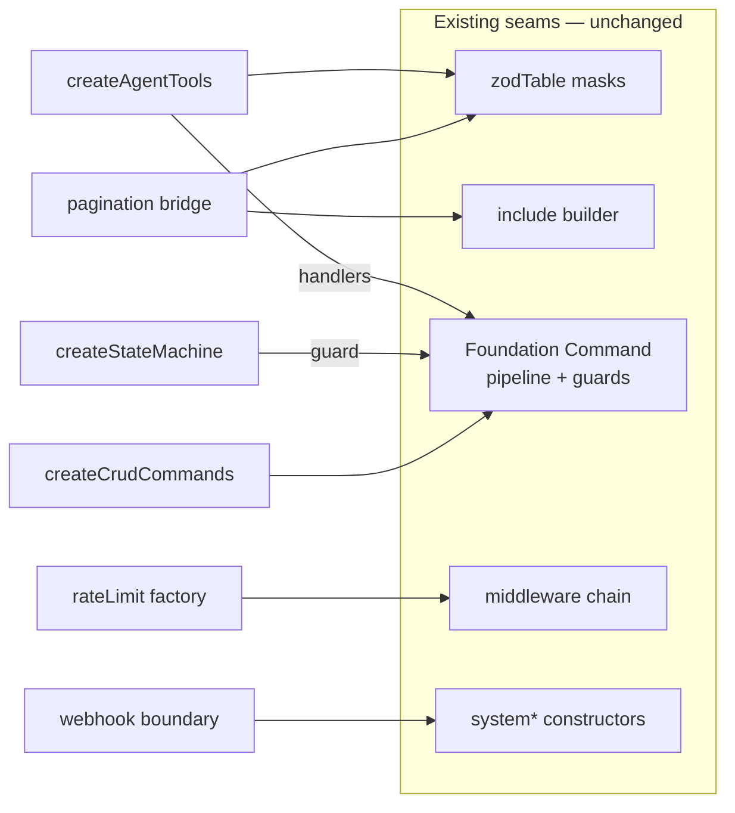

# feat: v0.1.0 feature set — the six roadmap helpers + release discipline

## Summary

Implement cvx-kit `v0.1.0` as defined in `ROADMAP.md`: the six planned
features (pagination bridge, CRUD command factory, state-machine helper,
rate-limit middleware factory, webhook boundary helper, agent tool
generator), the typed-middleware-context tightening they build on, and the
release discipline that starts at 0.1.0 — `CHANGELOG.md`, GitHub Releases on
every tag, and a shipped upgrade guide (the "migration file") documenting the
old way → new way for consumers on 0.0.x.

**Product Contract preservation:** n/a — solo plan; scope confirmed in-session.

---

## Problem Frame

cvx-kit 0.0.8 has the structural kernel (boundaries, auth, tenancy, commands,
middleware) but consumers still hand-write the same per-entity code: CRUD
operations, transition guards, pagination plumbing, rate limits, webhook
dedup, and agent tool definitions. 0.1.0 is "the big one" (see
`docs/explain/roadmap-to-1.0.0.html`): ship the full helper surface in one
release so consumers adopt a complete kit once, and switch on the semver
discipline (breaking = minor only, CHANGELOG, GitHub Releases) at the same
moment.

## Requirements

- R1. `paginated(dto)` helpers + a `paginate` terminal on `include` give
  cursor pagination with zod-typed args/returns.
- R2. `createCrudCommands` generates create/update/archive operations from a
  `zodTable`, fully inside the audited command pipeline.
- R3. `createStateMachine` produces typed transition predicates/assertions
  from a constants tuple, usable as command guards.
- R4. A packaged rate-limit middleware factory works on both Command and
  Query middleware seams, keyed by ctx (default `ctx.tenant`).
- R5. A webhook boundary helper provides signature verification + natural-key
  dedup + delegation to internal functions.
- R6. `createAgentTools` emits agent tool definitions from the existing
  `tools.*` masks whose handlers route through command executors —
  shape-compatible with `@convex-dev/agent`, no dependency on it.
- R7. Middleware context enrichment is typed: `next({ context })` widens the
  downstream ctx type; the existing loose form keeps compiling.
- R8. `CHANGELOG.md` exists; every release tag gets a GitHub Release whose
  notes come from the CHANGELOG (user-directed: changelog also on GitHub
  versioning).
- R9. A shipped upgrade guide documents 0.0.x → 0.1.0 per feature (old way →
  new way), and every new feature has a docs page/section + `llms.md` entry
  + tests.
- R10. All existing invariants hold: facade-only foundation runtime exports,
  middleware inside pipeline invariants, strict boundary schemas, tarball =
  dist + docs + `src/test.ts` only.

## Key Technical Decisions

- KTD1. **One new runtime dependency only: `@convex-dev/rate-limiter`**
  (session-settled: user-approved — chosen over also depending on
  `@convex-dev/agent`: the rate-limit factory calls the limiter at runtime,
  while agent tools can be emitted shape-compatible). The host mounts the
  rate-limiter component; the kit factory receives the constructed
  `RateLimiter` instance (injection, per the kit's no-singletons rule).
- KTD2. **Agent tool generator is dependency-free** (session-settled:
  user-approved). It returns `{ name, description, args, handler }` records
  where `args` is a zod schema (using `jsonSafeZid` internally) — directly
  consumable by `@convex-dev/agent`'s `createTool` and adaptable to ai-sdk
  `tool()`. Verified against `@convex-dev/agent@0.6.4`'s contract.
- KTD3. **Typed middleware context lands first** (session-settled:
  user-directed — pulled from the consolidation list because the rate-limit
  factory should land on final typing, not the loose v1). Backward
  compatible: an untyped `next({ context })` still compiles.
- KTD4. **New helpers ship as subpath exports** matching the existing
  pattern (`cvx-kit/pagination` style is rejected — see below): `crud`,
  `state-machine`, `middleware`, `webhooks`, `agent-tools` each get a
  subpath + index re-export; pagination joins existing homes (`zod-table`
  for schema helpers, `auth` for the include terminal) rather than a new
  module, since it derives from those seams.
- KTD5a. convex-helpers' same-named `crud` helper was considered and
  rejected: it bypasses the command pipeline (no audits, no guards, hard
  deletes) — `src/docs/crud.md` states the distinction.
- KTD5. **CRUD factory takes the Foundation-bound `Command` class as input**
  — `createCrudCommands({ Command, table, ... })` — never imports it. Keeps
  the facade-only rule intact: the factory is a *user* of the destructured
  facade, exactly like a domain module.
- KTD6. **Webhook dedup storage is host-owned**: the helper exports a
  `webhookEventsTable()` (a plain `zodTable`) the host registers in its
  schema, and the boundary helper receives the table name + internal
  function references. The kit gains no tables (components own zero
  application capability).
- KTD7. **GitHub Releases are created by the existing release workflow**
  (user-directed: "the changelog also should be on the github versioning") —
  a step after successful publish extracts the current version's CHANGELOG
  section and runs `gh release create` with it. The deprecated action pins
  (`actions/checkout`, `actions/setup-node`) get bumped in the same touch.
- KTD8. **Upgrade guide ships in package docs** (session-settled:
  user-approved — chosen over root-only `MIGRATING.md`): authored at
  `src/docs/upgrading.md`, synced to `docs/` like the rest, linked from
  README and `llms.md`.

## High-Level Technical Design

How the six features attach to existing seams (nothing new is load-bearing —
every feature is a consumer of an existing extension point):

Directional guidance, not implementation specification.

---

## Implementation Units

### U1. Typed middleware context accumulation

**Goal:** `next({ context })` widens the downstream ctx type; guards and
handlers after an enriching middleware see the enrichment in types.
**Requirements:** R7, R10. **Dependencies:** none.
**Files:** `src/components/foundation/client.ts`,
`src/components/foundation/modules/query/query.ts`,
`test/command.test.ts`, `test/query-middleware.test.ts`.
**Approach:** Generic parameter on the middleware helper
(`Command.middleware<Ctx, Extension>`) so the middleware's declared extension
threads into the chain's context type; runtime unchanged (merge already
works). Keep `CommandMiddleware`/`QueryMiddleware` assignable from the loose
form. TanStack-style full inference across an array is explicitly NOT the
goal for 0.1.0 — per-middleware declared extensions are enough.
**Test scenarios:**
- A middleware declaring `{ vendor: string }` lets the guard/handler use
  `ctx.vendor` without casts (type-level test via `tsc` on a fixture).
- Existing untyped middleware in `test/command.test.ts` compiles unchanged.
- Runtime ordering tests keep passing (no behavior change).
**Verification:** typecheck + full suite green; no `as never` needed in the
middleware tests that previously required it.

### U2. Pagination bridge

**Goal:** cursor pagination with zod-typed boundaries.
**Requirements:** R1, R10. **Dependencies:** none.
**Files:** `src/zod-table.ts` (arg/return schema helpers), `src/auth.ts`
(`paginate` terminal on `IncludedQuery`), `test/pagination.test.ts`,
`test/fixture/functions.ts` (one paginated query),
`src/docs/zod-table.md`, `src/docs/auth.md`, `src/docs/llms.md`.
**Approach:**
1. `paginated(dto)` → `{ args: convexToZod(paginationOptsValidator)`-based
   opts schema, `returns:` a zod page result (`page: dto[]`, `isDone`,
   `continueCursor`) via convex-helpers bridges.
2. `include(...).paginate(opts, transform?)` terminal calling Convex's
   `query.paginate(opts)` on the selected indexed query; page size bounded by
   the same `maxRows` policy as `execute`.
**Execution note:** verify early that a paginated read works through the
RLS-wrapped reader (tenancy fixture) — if the wrapped reader doesn't support
`paginate`, that's a planning-assumption failure to surface, not to patch
around silently.
**Test scenarios:**
- Happy path: two pages traverse a seeded fixture table via an index;
  cursors chain; `isDone` terminates.
- DTO projection: page items pass through `toPublicDto` transform.
- Bound: page size above `maxRows` rejects with `INVALID_REQUEST_BOUNDARY`.
- Tenancy: paginated scan in the tenant fixture returns only the caller
  tenant's rows.
- Short pages: with foreign-tenant rows interleaved, pages may be shorter
  than `numItems` but cursors remain correct and traversal completes.
**Verification:** suite green including the tenancy pagination case.

### U3. State-machine helper

**Goal:** typed transition legality from constants tuples.
**Requirements:** R3. **Dependencies:** none.
**Files:** `src/state-machine.ts` (new), `src/index.ts`, `package.json`
(exports subpath `./state-machine`), `test/state-machine.test.ts`,
`src/docs/commands.md` (guard example), `src/docs/llms.md`.
**Approach:** `createStateMachine(STATES, transitions)` where `transitions`
is `Partial<Record<State, readonly State[]>>` typed against the tuple.
Returns `{ states, can(from, to), assert(from, to, errors?) }`; `assert`
throws via the injected `ErrorFactory` (default `KitError`,
`INVALID_TRANSITION`) so it drops into command guards.
**Patterns to follow:** vocabulary-tuple convention from `conventions.md`;
error injection from `src/errors.ts`.
**Test scenarios:**
- Legal transition passes; illegal throws `INVALID_TRANSITION`.
- A state with no outgoing transitions rejects everything.
- Type-level: a literal not in the tuple fails to compile in `transitions`.
- Custom `ErrorFactory` receives the throw.
**Verification:** suite green; the commands.md guard example compiles as
written in a fixture.

### U4. CRUD command factory

**Goal:** standard create/update/archive operations from one declaration.
**Requirements:** R2, R10. **Dependencies:** U1 (types). (U3 is referenced
only by the archive-guard docs example, not by the implementation — U3 and U4
can proceed in parallel.)
**Files:** `src/crud.ts` (new), `src/index.ts`, `package.json` (subpath
`./crud`), `test/crud.test.ts` (real-runtime via a fixture),
`test/fixture/` additions, `src/docs/crud.md` (new), `src/docs/llms.md`,
README modules section.
**Approach:** `createCrudCommands({ Command, table, aggregateType,
classification?, actor, archive?, guards?, middleware? })` returning
`{ operations, executeCreate, executeUpdate, executeArchive }`:
1. Operation keys derived `<tableName>.create|update|archive`.
2. `create` input = `table.commandInput` (+ injected ids the host declares);
   handler inserts with `tenant`/server fields stamped via a host-provided
   `enrich(ctx, command)` callback (keeps the factory tenancy-agnostic).
3. `update` input = commandInput partial + id; `archive` sets `archivedAt`
   (soft delete per kit doctrine — no hard-delete operation is generated).
4. Audit derivation built from `aggregateType` + actor mapping; `aggregates:
   [aggregateType]` declared so the allowlist enforces it.
**Test scenarios:**
- Create/update/archive execute on the real runtime through authMutation
  adapters in the fixture; rows reflect changes; audits written with the
  declared aggregate type.
- Update with a field outside `commandFields` rejects (strict schema).
- Archive sets `archivedAt`, leaves the row (no delete).
- Guards passed per-operation run before handlers (reuse guard-order test
  approach from `test/command.test.ts`).
- Generated operations respect `classification` default `'business'`.
- Tenancy: in the tenant fixture (factory registered behind tenant RLS rules),
  an update/archive targeting another tenant's document id rejects, and a
  create whose enrich fails to stamp `tenant` is rejected by RLS — mirrors
  U2's tenancy case. `enrich` is REQUIRED when the table is a tenantTable
  (compile-level where feasible).
**Verification:** suite green; `docs/crud.md` example is the fixture code.

### U5. Rate-limit middleware factory

**Goal:** first packaged middleware.
**Requirements:** R4, R10. **Dependencies:** U1.
**Files:** `src/middleware.ts` (new; home for packaged middleware),
`src/index.ts`, `package.json` (dependency `@convex-dev/rate-limiter@^0.3`,
subpath `./middleware`), `test/middleware.test.ts`,
`src/docs/commands.md` (middleware section), `src/docs/tenancy.md` (keying
note), `src/docs/llms.md`.
**Approach:** `rateLimit({ limiter, name, key?, onLimit? })` returning a
`CommandMiddleware` (and a query variant): before `next()`, call
`limiter.limit(ctx, name, { key: key?.(ctx) ?? ctx.tenant })`; on rejection
throw via `ErrorFactory` (`RATE_LIMITED`, carrying `retryAfter` in the
message/metadata) or call `onLimit`. The limiter instance is injected —
checked against registry snapshot of `@convex-dev/rate-limiter@0.3.2` (re-verify at install) (`new
RateLimiter(components.rateLimiter, { limits })`, `limit(ctx, name, { key
})` returning status). The kit never mounts the component; docs show host
mounting.
**Test scenarios:**
- Fake limiter injected: under-limit passes through and handler runs.
- Over-limit: handler never runs, `RATE_LIMITED` thrown, audit skipped.
- Default key is `ctx.tenant`; custom `key` fn receives the ctx.
- No `key` fn and `ctx.tenant` undefined: configuration error, handler never
  runs.
- Works in both registry-wide and per-operation middleware slots (order
  test).
**Verification:** suite green; publint clean with the new dependency external
in the build (attw stays deferred per Scope Boundaries).

### U6. Webhook boundary helper

**Goal:** the sanctioned webhook pattern as code.
**Requirements:** R5, R10. **Dependencies:** none.
**Files:** `src/webhooks.ts` (new), `src/index.ts`, `package.json` (subpath
`./webhooks`), `test/webhooks.test.ts` (real runtime),
`test/fixture-webhooks/` (schema + functions + `_generated` stub),
`src/docs/webhooks.md` (new), `src/docs/llms.md`.
**Approach:**
1. `webhookEventsTable()` — a plain `zodTable` (`eventKey`, `receivedAt`,
   `source`) the host registers; `by_eventKey` index documented.
2. `createWebhookBoundary({ verify, eventKey, table?, errors? })` returning
   `handle(ctx, request, target)` for use inside the host's `httpAction`:
   verify signature over the RAW request body (`request.text()` handed to
   `verify` before any parsing; docs example uses constant-time comparison —
   `crypto.subtle` HMAC verify — with the secret read from a Convex env var;
   throw on failure), compute the natural key, `runMutation(target, payload)` where `target` is a host internal
   mutation that calls the kit's `recordWebhookEvent(ctx, key)` guard —
   insert-if-absent, return `duplicate: true` when seen (dedup is
   transactional inside the mutation, not in the action).
**Execution note:** dedup must live in the mutation (transactional), not the
action — design the API so the helper makes this the easy path.
**Test scenarios:**
- First delivery processes; identical redelivery (same natural key) is a
  no-op reporting duplicate.
- Failed signature verification throws before any write.
- Verification runs against the raw body bytes, not a re-serialized parse.
- Two different events with different keys both process.
- Key derivation follows `${event}:${id}:${updatedAt}` in the docs example.
**Verification:** suite green on the real runtime fixture.

### U7. Agent tool generator

**Goal:** LLM tools that are audited commands.
**Requirements:** R6, R10. **Dependencies:** U2 (list args derive from
pagination opts), U4 (mutation executors are the natural handlers).
**Files:** `src/agent-tools.ts` (new), `src/zod-table.ts` (switch `tools.update`/`tools.id`
masks from `zid` to `jsonSafeZid` so the masks are JSON-schema-safe as KTD2
assumes; compile-time Id types preserved), `src/index.ts`,
`package.json` (subpath `./agent-tools`), `test/agent-tools.test.ts`,
`src/docs/agent-tools.md` (new), `src/docs/llms.md`.
**Approach:** `createAgentTools(table, { create?, update?, get?, list? })`
mapping the existing `table.tools.*` masks to tool records `{ name,
description, args, handler }`: `args` are the masks (already `jsonSafeZid`
-safe), `description` derived (`Create a <tableName> record`, overridable),
`handler: (ctx, input) => executor(ctx, input)` wiring the caller-supplied
executors. Read contract: `get` uses the `tools.id`
mask with a caller-supplied read handler; `list` args derive from U2's
pagination opts schema with a caller-supplied query handler (reads do not
route through commands). Shape-compatible with `@convex-dev/agent`'s
`createTool` (checked against registry snapshot 2026-08-14; re-verify at
install time) — the host spreads the record into `createTool` or
ai-sdk `tool()`; the kit imports neither.
**Test scenarios:**
- Generated `args` for create equals `table.tools.insert` (mask reuse, no
  drift).
- Handler invocation routes to the supplied executor with parsed input.
- Ids present as plain strings in JSON schema (jsonSafeZid behavior holds
  through the mask).
- Only requested tool kinds are emitted; names are `<tableName>_<verb>`.
**Verification:** suite green; docs example type-checks against a stub
`createTool` signature in tests.

### U8. CHANGELOG + GitHub Releases + workflow hardening

**Goal:** release discipline switched on.
**Requirements:** R8. **Dependencies:** none (can land first).
**Files:** `CHANGELOG.md` (new; backfill 0.0.1–0.0.8 briefly, then 0.1.0),
`.github/workflows/release.yml` (release-notes step + updated action pins),
`README.md` (Releasing section), `ROADMAP.md` (check boxes as they complete).
**Approach:** Keep-a-Changelog format. After the publish step succeeds, a
step extracts the current tag's section from `CHANGELOG.md` and creates the
GitHub Release (`gh release create "$TAG" --notes-file`), using the
workflow's `GITHUB_TOKEN` (needs `contents: write` on the job — scope it to
the release job only). Bump `actions/checkout` and `actions/setup-node` pins
to current majors to clear the Node-20 deprecation annotation.
**Test scenarios:** `Test expectation: none — CI configuration; verified by
the 0.1.0 release run producing a GitHub Release with the changelog section
as notes.`
**Verification:** (1) the CHANGELOG-section extraction runs locally against
the backfilled file and yields the 0.1.0 section verbatim BEFORE tagging;
(2) the v0.1.0 tag run publishes to npm AND creates a GitHub Release with
correct notes. Backfill source of truth: `git log` + release history, not
memory.

### U9. Upgrade guide (the migration file) + docs pass

**Goal:** consumers on 0.0.x know the new way.
**Requirements:** R9. **Dependencies:** U1–U7 (documents them).
**Files:** `src/docs/upgrading.md` (new), `src/docs/llms.md` (exports map +
rules updates for all new modules), `README.md` (docs list + modules),
`src/docs/conventions.md` (where the new helpers fit the file anatomy).
**Approach:** `upgrading.md` is organized old way → new way per feature:
hand-written CRUD operations → `createCrudCommands`; hand-rolled transition
`if`s → `createStateMachine`; `.take()` loops → `paginate`; hand-rolled
limiter checks → `rateLimit` middleware; ad-hoc webhook dedup →
`createWebhookBoundary`; hand-written agent tools → `createAgentTools`;
untyped middleware ctx → typed extensions. Each entry: before-snippet,
after-snippet, and what stays unchanged. Also records the 0.1.0 semver
contract switch WITH the caveat (per review): the six new export surfaces
get final-name review during implementation, and the breaking window
formally closes at the follow-up consolidation release (name decision + API
audit) — CHANGELOG and upgrading.md both state this.
**Test scenarios:** `Test expectation: none — documentation; correctness is
enforced by U1–U7 examples being lifted from fixture code.`
**Verification:** every new export appears in `llms.md`'s tables; docs sync
ships the new pages in the tarball (dry-run check).

### U10. Release v0.1.0

**Goal:** ship it. **Requirements:** all. **Dependencies:** U1–U9.
**Files:** `package.json` (version via `npm version minor`).
**Approach:** full local verification (build → typecheck → test → tarball
dry-run), commit, `npm version minor`, push tag; watch the workflow publish
npm + GitHub Release.
**Test scenarios:** `Test expectation: none — release mechanics; gates are
the Verification Contract.`
**Verification:** registry shows 0.1.0 with provenance; GitHub Release
exists with changelog notes; a consumer install shows the new subpaths.

---

## Scope Boundaries

**In scope:** the ten units above.

### Deferred to Follow-Up Work
- Package-name decision + full export-name API audit (user decision;
  remaining 0.1.0 roadmap items — do before or immediately after this ships,
  since the upgrade guide will need a rename note if the name changes).
- `attw` + pack dry-run in CI (roadmap 0.1.0 CI-hardening item not blocking
  the features; the pin bumps land in U8).
- Full TanStack-style middleware chain inference (per-middleware declared
  extensions are the 0.1.0 contract; array-level inference is future work).

### Outside this product's identity
- Idempotency store, frontend bindings, multi-provider auth abstractions
  (per `ROADMAP.md` out-of-scope section).

## Open Questions (deferred to implementation)
- ~~RLS-wrapped `paginate` support~~ RESOLVED during review: the wrapper
  supports `paginate` (convex-helpers filter WrapQuery). Real caveat:
  filtered pagination can return pages SHORTER than `numItems` when RLS
  rejects rows — U2 tests cursor correctness under mid-page filtering and
  the docs state the short-page contract.
- Exact `RateLimiter` status shape on rejection (`retryAfter` field name) —
  read from the installed package at implementation time.

## Risks
- **Dependency drift:** `@convex-dev/rate-limiter` peer-depends on
  `convex ^1.24.8` (compatible) but pulls a React peer — verify it stays a
  server-only import path so consumers without React aren't warned. If
  noisy, document or mark peer-optional in kit docs.
- **U4 API surface:** the CRUD factory is the most opinion-dense new API;
  wrong defaults here are expensive post-0.1.0. Mitigation: fixture-first
  design (write the consuming fixture before the factory), and the archive
  operation stays soft-delete-only.
- **Release workflow token:** `gh release create` needs `contents: write`;
  the job currently has `contents: read`. Scope the elevation to the release
  job only.

## Verification Contract
- `bun run build` (includes bridge + publint), `bun run typecheck`,
  `bun run test` all green.
- Tarball dry-run: dist + docs + `src/test.ts` only; all new docs pages
  present; new subpaths resolve (publint).
- Tenancy suite still proves isolation with pagination added.
- Every new runtime export has ≥1 test and an `llms.md` row.

## Definition of Done
- All ten units complete; `cvx-kit@0.1.0` live on npm with provenance.
- GitHub Release v0.1.0 exists with CHANGELOG-derived notes.
- `ROADMAP.md` 0.1.0 feature checkboxes checked (consolidation items that
  remain open — name decision, API audit — explicitly unchecked with a note).

## Sources & Research
- `ROADMAP.md` (origin), `docs/explain/roadmap-to-1.0.0.html`.
- Session context: this repo's full source (authored this session).
- Registry: `@convex-dev/rate-limiter@0.3.2` API (constructor, named limits,
  `limit(ctx, name, { key })`); `@convex-dev/agent@0.6.4` peers/contract.
- convex-helpers: `convexToZod` (zod4), `paginationOptsValidator` (convex).
