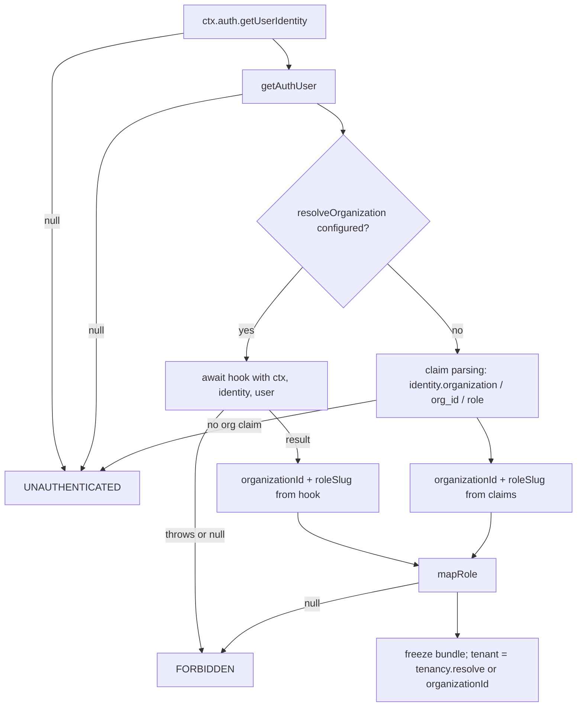

# resolveOrganization Auth Hook - Plan

## Goal Capsule

- **Objective:** Apps whose identity tokens carry no organization/role claims can use every cvx-kit auth constructor by resolving membership from their own database, and the capability ships documented in the next release.
- **Means:** An optional `resolveOrganization` hook on `AuthFunctionsConfig`, per the API shape in issue #8 (KTD1).
- **Authority:** This plan; issue #8 (`ImRLopezAG/cvx-kit#8`) for the API contract; existing fail-closed semantics in `src/auth.ts` for behavior precedent.
- **Stop conditions:** Stop if implementing the hook requires changing the tenancy/RLS engine (`src/tenancy.ts`) or breaking any existing config field — that contradicts R5 and needs a user decision.
- **Tail ownership:** Ends when the Definition of Done holds; releasing the version itself (`release:minor`) is the maintainer's call.

---

## Product Contract

### Summary

Add an optional `resolveOrganization` hook to `createAuthFunctions` so identity providers without org JWT claims (custom credentials, magic codes, app-table memberships) can resolve organization and role from the database. Claim-based resolution stays the default; behavior is fully backwards compatible. Ships with tests, docs, and a changelog entry targeting the next minor version.

### Problem Frame

`authenticatedUser` in `src/auth.ts` resolves `organizationId` and `roleSlug` exclusively from JWT claims (`identity.organization.*`, `identity.org_id`, `identity.role`). Providers that keep membership in app tables cannot use the kit's auth constructors without stuffing claims at sign-in or bypassing the kit entirely — defeating centralized tenant resolution. Issue #8 reports this from a real migration and proposes the hook; the reporter offered a PR, so landing the agreed shape upstream also closes the issue.

### Requirements

- R1. `AuthFunctionsConfig` accepts an optional `resolveOrganization` hook called with `{ ctx, identity, user }` after the user is resolved, returning `Promise<{ organizationId: string; roleSlug: string } | null>`.
- R2. When the hook is configured, its result overrides claim-based resolution for `organizationId` and role; claim parsing is not consulted.
- R3. When the hook returns `null`, authentication fails with `FORBIDDEN`.
- R4. The hook's `roleSlug` passes through `mapRole`; unknown roles reject with `FORBIDDEN`, exactly as claim-derived roles do today.
- R5. When the hook is not configured, observable behavior is unchanged for hook-less configurations (backwards compatible), proven by the existing claim-based regression suite.
- R6. The hook composes with existing machinery: `tenant` derives from the hook-resolved organization (via `security.tenancy.resolve` when set), and `verifyMembership` for actions continues to run against the hook-resolved `organizationId`.
- R7. The capability is documented (`src/docs/auth.md`, `src/docs/llms.md`, the `README.md` example) and recorded in `CHANGELOG.md` under Unreleased for the next minor release.
- R8. The documented hook contract carries two resolver obligations, each covered by a test: the lookup must bind its result to the verified user (never a caller-influenced or non-unique attribute), and revoked, inactive, or expired memberships must resolve to `null` so fail-closed revocation holds on queries and mutations.
- R9. The hook is usable from all three function kinds: in action invocations the hook's `ctx` is an action context with no `ctx.db`, so the documented pattern (and the docs example) must branch to `ctx.runQuery` of an internal query there.

### Key Decisions

- **Fail closed on `null`** — a configured hook is the source of truth; falling back to claims would let a revoked membership pass on stale claims. (session-settled: user-directed — chosen over claims-fallback: confirmed at scoping) Governs R3.
- **Hook composes with, not replaces, `verifyMembership`** — actions keep their live re-verification pipeline unchanged. (session-settled: user-directed — chosen over hook-as-live-check: confirmed at scoping) Governs R6.

### Scope Boundaries

- No changes to the tenancy/RLS engine (`src/tenancy.ts`) or trigger machinery.
- No new auth providers or provider adapters.

#### Deferred to Follow-Up Work

- A convenience helper that builds `resolveOrganization` from a membership table + index name (only if consumer demand appears after release).

---

## Planning Contract

### Key Technical Decisions

- KTD1. **API shape follows issue #8 verbatim** — `resolveOrganization?: (input: { ctx, identity, user }) => Promise<{ organizationId, roleSlug } | null>`, typed against the existing `AnyAuthContext<DataModel>` and `UserIdentity`. Rationale: the shape already composes with `mapRole` and `verifyMembership`, and matching it lets the issue close without API renegotiation. (session-settled: user-approved — chosen over redesigning the signature: confirmed at scoping)
- KTD2. **Resolution happens inside `authenticatedUser`** so queries, mutations, AND actions all inherit it from one place; `actionInput`'s `verifyMembership` re-resolution runs afterward, unchanged. Rationale: `actionInput` calls `authenticatedUser` first, so no second integration point is needed. Constraint (R9): in actions the hook receives a `GenericActionCtx`, which has no `db` — a hook body doing `ctx.db.query(...)` will not typecheck against `AnyAuthContext` and would throw in actions, which KTD3's fail-closed catch masks as `FORBIDDEN`. The docs example must therefore branch (`'db' in ctx ? ctx.db... : ctx.runQuery(internal...)`) or use a `runQuery`-based lookup throughout.
- KTD3. **Hook errors fail closed with `FORBIDDEN`**, mirroring the existing `verifiedMembership` catch-and-reject pattern (`src/auth.ts`, `verifiedMembership`). Rationale: an erroring membership lookup must not authenticate anyone; consistency with the kit's only other injected-lookup precedent.
- KTD4. **The `UNAUTHENTICATED`-vs-`FORBIDDEN` boundary is preserved**: missing identity/user stays `UNAUTHENTICATED`; a resolved user without a usable org/role (hook `null`, unknown role) is `FORBIDDEN`. The existing missing-claim `UNAUTHENTICATED` path is untouched for hook-less configs.

### Assumptions

- Hook return of a non-null result with an empty-string `organizationId` is treated as a hook-author bug, not specially validated (same trust level as `verifyMembership`'s return today).

### High-Level Technical Design

Resolution order inside `authenticatedUser` after the hook lands:

Actions then proceed through `actionInput` → `verifiedMembership` exactly as today, using the bundle's `organizationId` (now possibly hook-resolved).

---

## Implementation Units

### U1. Add the `resolveOrganization` hook to `createAuthFunctions`

- **Goal:** Hook-configured apps resolve org/role from the database; unconfigured apps are unchanged.
- **Requirements:** R1, R2, R3, R4, R5, R6
- **Dependencies:** none
- **Files:** `src/auth.ts`
- **Approach:**
  - Add the `resolveOrganization` field to `AuthFunctionsConfig` with the KTD1 signature and a doc comment matching the style of `verifyMembership`'s.
  - In `authenticatedUser`, after the identity/user guard: when the hook is configured, call it in a try/catch; a throw or `null` result rejects with `FORBIDDEN` (KTD3); otherwise use its `organizationId`/`roleSlug` and skip claim parsing (KTD2, KTD4). The rest of the function (`mapRole`, freeze, tenant derivation) is shared by both branches.
- **Patterns to follow:** `verifiedMembership` in `src/auth.ts` for fail-closed error handling; existing doc-comment voice on `AuthFunctionsConfig` fields.
- **Test scenarios:** covered in U2 (same behavior surface).
- **Verification:** `bun run typecheck` passes; no existing test changes needed for hook-less configs.

### U2. Real-runtime tests for hook-based resolution

- **Goal:** The hook's contract (override, fail-closed, mapRole, composition) is proven on the real Convex runtime.
- **Requirements:** R2, R3, R4, R5, R6, R8, R9
- **Dependencies:** U1
- **Files:** `test/convex-auth.test.ts` (or a sibling `test/convex-auth-resolve-org.test.ts` if the fixture diverges), new or extended fixture under `test/fixture/` with a membership table and a `createAuthFunctions` config using `resolveOrganization`. Base identities in these tests carry **no** `org_id`/`role` claims; scenarios that test claim-override behavior create additional identities **with** claims as needed.
- **Approach:** Mirror the existing `convexTest(schema, modules)` harness and `withIdentity` style. Seed membership rows via a system/internal function or `t.run`.
- **Test scenarios:**
  - Happy path: identity without org claims + membership row → query and mutation succeed; `ctx.actor.organizationId` matches the membership row.
  - Hook returns `null` (no membership row) → `FORBIDDEN`.
  - Hook returns an unknown `roleSlug` → `FORBIDDEN` (mapRole rejection).
  - Hook configured but identity missing entirely → `UNAUTHENTICATED` (boundary preserved, KTD4).
  - Hook throws → `FORBIDDEN` (fail closed, KTD3).
  - Hook result overrides present-but-different claims: identity carries `org_id: 'org_claims'`, membership row says `org_db` → actor org is `org_db`.
  - Claim parsing is fully bypassed (R2): identity carries malformed/unknown org and role claims plus a valid membership row → authentication succeeds on the hook-derived org and mapped role.
  - Action path (R9): an `authAction` with the hook configured (a `runQuery`-based hook body) authenticates a claims-less identity successfully.
  - Composition with `verifyMembership` (R6): with both configured, an action asserts `verifyMembership` receives the hook-resolved `organizationId` (not a claim value); a `verifyMembership` null/mismatch result rejects with `FORBIDDEN`.
  - Identity binding (R8): a negative cross-user test — user A's identity can never receive user B's membership row or organization.
  - Revocation (R8): a revoked/inactive membership row resolves to `null` in the example predicate → `FORBIDDEN` on queries and mutations.
  - Composition with tenancy (mandatory, end-to-end): with `security.tenancy` configured, rows written under two different hook-resolved tenants are mutually invisible through the auth constructors' RLS-wrapped database (a direct `ctx.tenant` assertion is not an acceptable substitute).
  - Hook-less missing-claim regression (R5): a valid identity with a resolved user but no org/role claims, and no hook configured → `UNAUTHENTICATED`, exactly as today.
  - Regression: existing claim-based suite passes unmodified (R5).
- **Verification:** `bun run test` green.

### U3. Documentation

- **Goal:** A consumer with a claims-less provider can adopt the hook from the docs alone.
- **Requirements:** R7, R8, R9
- **Dependencies:** U1
- **Files:** `src/docs/auth.md`, `src/docs/llms.md` (edit sources — `docs/` is generated by `docs:sync`, never edit it directly), `README.md` (extend its existing `createAuthFunctions` example with the new field).
- **Approach:** In `auth.md`, add a section alongside "Queries/mutations trust the JWT; actions re-verify": when to use the hook (no org claims in tokens), resolution order (hook overrides claims; `null`/error → `FORBIDDEN`), a `companyUsers`-style example handler that is action-safe per R9 (branching to `ctx.runQuery` where `ctx.db` is absent), the resolver obligations per R8 (bind the lookup to the verified user; resolve revoked/inactive/expired memberships to `null`), the composition notes (mapRole still applies; tenant derives from the hook's org; `verifyMembership` unchanged), and the cost note (one DB read per authed call vs. free claims). Add the field to `llms.md`'s config surface.
- **Test scenarios:** Test expectation: none — documentation-only unit; U4's verification covers `docs:sync` freshness.
- **Verification:** Rendered docs read coherently; example compiles conceptually against the U1 signature.

### U4. Changelog and release readiness

- **Goal:** The feature is recorded for the next minor release and issue #8 can be closed by the shipping PR.
- **Requirements:** R7
- **Dependencies:** U1, U2, U3
- **Files:** `CHANGELOG.md`
- **Approach:** Add an `### Added` entry under `## [Unreleased]` describing the hook and its fail-closed semantics, in the file's existing voice. The PR description references "Closes #8". Actual version bump stays with the maintainer via `release:minor`.
- **Test scenarios:** Test expectation: none — release metadata only.
- **Verification:** `bun run prepublishOnly` (build + typecheck + test + docs:sync) succeeds locally.

---

## Verification Contract

| Gate | Command | Applies to |
|---|---|---|
| Types | `bun run typecheck` | U1 |
| Runtime test suite | `bun run test` | U1, U2 |
| Full release gate | `bun run prepublishOnly` | U4 (final) |

All new tests run on the real Convex runtime via `convex-test`, matching the existing suite; no mocked auth paths.

## Definition of Done

- All four units complete; R1–R9 each traceable to landed code, tests, or docs.
- Existing test suite passes unmodified (R5 proof).
- `bun run prepublishOnly` green.
- `CHANGELOG.md` Unreleased section carries the entry; docs sources updated (not the generated `docs/` copies).
- No dead-end or experimental code left in the diff.
- Follow-up: shipping PR references issue #8 so it closes on merge.
