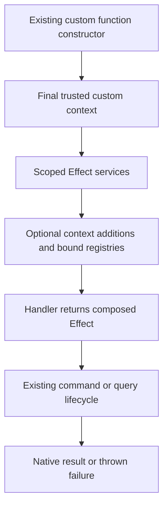

# Optional Command Context Injection - Plan

## Goal Capsule

- Objective: Application authors can call commands from their existing custom function helpers without repeating dependencies, and can keep large applications organized into small feature contexts.
- Means: Optional registry binding and typed context extensions at the existing Effect API boundary (KTD1, KTD2).
- Authority: The Product Contract governs behavior; technical decisions govern implementation within that contract.
- Execution: Implement and test locally on the requested new branch. The current session owns integration and independent review.
- Stop conditions: Do not weaken trusted context, erase Effect requirements, or publish a release as part of this change.

---

## Product Contract

### Summary

Add optional context binding to Effect command and query registries and support context additions in the existing API adapters. Document small and large application composition with executable examples.

### Problem Frame

Passing the same context at every execution creates repetition. Treating every command group as part of a single context makes larger applications difficult to reason about. Earlier examples also obscured the distinction between domain dependencies and lifecycle policy dependencies.

### Key Decisions

- Existing function helpers carry context (session-settled: user-directed — chosen over a host property and new consumer-facing helper names: custom context already belongs to the function boundary). Governs R1, R4.
- Binding is optional (session-settled: user-directed — chosen over mandatory application-wide injection: some operations need no domain dependencies). Governs R2, R7.
- Feature-scoped composition (session-settled: user-approved — chosen over one application-wide command map: 25–50 entities may require different services and nested commands). Governs R3, R7.

### Requirements

**Registry execution**

- R1. Bound registries execute with operation name and input while declared callbacks receive the context selected by their existing resolver.
- R2. Existing explicit three-argument execution remains supported; dependency-free handlers do not require application context injection.
- R3. Different registries may select different domain dependencies, including other bound commands, services, and business functions.
- R4. Existing custom function constructors retain their custom context when the API boundary adds bindings.
- R5. Binding is invocation-local and lazy, without rebuilding registries or executing resolvers and dependencies at binding time.
- R6. Preserve operation input/result/error/service types and the full permission, prepare, middleware, audit, completion, and failure lifecycle.

**Documentation and distribution**

- R7. Explain injection as optional practice, with examples for explicit execution, no domain dependencies, one group, feature-scoped groups, and nested commands.
- R8. Compile public documentation examples against the packed package and preserve consumers that do not install Effect.

### Scope Boundaries

No global current-context storage, automatic dependency graph, resource container, context cache, or new auth/organization policy. Such mechanisms are unnecessary for explicit per-feature factories. No release or remote deployment.

### Acceptance Examples

- AE1. Covers R1, R4, R5: a custom authenticated mutation injects a random number and bound task commands; its handler executes by name/input and receives that request's value.
- AE2. Covers R3, R6: a task handler composes a notification command Effect; both complete in the same boundary and retain independently selected contexts.
- AE3. Covers R5, R6: concurrent invocations carry different actors and values through handlers and audit writers without mixing them.
- AE4. Covers R2, R7: a handler that needs only input executes explicitly with an undefined domain context while configured lifecycle dependencies remain enforced.

---

## Planning Contract

### Key Technical Decisions

- KTD1. Add a small binding handle to both registries that delegates execution to the existing registry with its captured invocation value. It must not cache resolved domain context. Implements R1–R3, R5–R6.
- KTD2. Extend the existing native and Zod Effect API adapters with an optional context-addition callback. Keep application exports named authMutation, adminQuery, or their existing custom names; do not introduce a separate helper family. Implements R4.
- KTD3. Construct services, then context additions, then invoke the handler within the same scoped Effect. Context initialization requirements must be satisfied by provided services or Scope. Reuse the existing failure projection and native throw behavior. Implements R5–R6.
- KTD4. Context additions must not replace existing trusted context fields. Preserve input customizations already made by the supplied constructor; add new fields with exact inferred types. Implements R4, R6.
- KTD5. Keep resolver configuration explicit in this increment. No-domain-dependency examples use a resolver returning undefined and explicit execution or optional binding. Omitting resolver configuration is not necessary to satisfy R2.
- KTD6. Leave the Effect-free auth factory unchanged. Existing adapters already consume its constructors and arbitrary Zod custom constructors. Application composition belongs in its central functions module or feature-specific constructor module. Implements R4, R8.

### High-Level Technical Design

API grammar, as directional guidance: a registry supports explicit execution and binding an invocation value; a bound handle supports operation-plus-input execution. An adapter optionally accepts a context-extension factory and optionally a service provider. Extensions may contain named command groups or other dependencies. Nested commands compose Effects rather than starting another runner.

### Assumptions

Feature scoping remains an application choice rather than a library graph-management facility. No new organization constructor is required: supplied custom constructors receive the same adapter support.

### Sources and Research

- src/modules/effect/command.ts and query.ts: generic execution and invocation-local resolvers.
- src/modules/effect/api-runtime.ts: scoped provider execution, failure projection, and native throw boundary.
- src/modules/effect/api-zod.ts: custom context overwrite grammar and raw/parsed validation boundaries.
- src/auth.ts: auth, role, admin, and system constructors built from custom input callbacks.
- test/effect-api.test.ts and effect-api-zod.test.ts: concurrent service isolation, finalizers, custom input and native rollback.
- docs/plans/2026-10-06-1518-feat-foundation-effect-registries-plan.md: explicit invocation context and optional Effect boundary.

---

## Implementation Units

### U1. Optional registry binding

**Goal:** Supply an invocation value once without changing registry execution.
**Requirements:** R1–R3, R5–R6; KTD1, KTD5.
**Dependencies:** None.
**Files:** src/modules/effect/command.ts, src/modules/effect/query.ts, test/effect-context.test.ts, test/effect-command-types.ts, test/effect-query-types.ts.
**Approach:** Add delegating bound handles to the existing registries.
**Patterns:** Current operation-specific exec signatures and lazy lifecycle.
**Test scenarios:**
1. Bind two values to one registry; constructing handles and Effects runs no resolver.
2. Execute each handle and observe its value in handler, permission and audit paths.
3. Compose commands with different selected contexts and preserve result transformations.
4. Bound calls reject incorrect names, input, binding values and missing Effect services.
5. Bound query calls preserve query output, error and service types.
**Verification:** Existing registry tests and new runtime/type coverage pass.

### U2. Context additions in existing function adapters

**Goal:** Inject bindings and arbitrary custom dependencies through existing constructors.
**Requirements:** R4–R6; KTD2–KTD4, KTD6.
**Dependencies:** U1.
**Files:** src/modules/effect/api-runtime.ts, src/modules/effect/api.ts, src/modules/effect/api-zod.ts, test/effect-context.test.ts, test/effect-api-types.ts, test/effect-api-zod-types.ts.
**Approach:** Infer added context from an optional callback, preserve constructor-supplied fields, and initialize within the scoped provided environment. Service provision defaults to an empty context when omitted.
**Execution note:** Begin with custom-builder integration coverage that uses the existing fixtures.
**Test scenarios:**
1. Covers AE1: retain an arbitrary custom value and add bound commands in a real Zod mutation.
2. Covers AE3: concurrent invocations preserve actor, custom value, and audit identity.
3. Authentication denial or invalid arguments do not initialize additions.
4. Context initialization or nested command failure throws at the native boundary and rolls back writes.
5. Finalizers complete before returning or throwing.
6. Query, mutation, action, internal visibility, function-form registration and result transforms remain valid.
7. Reject collisions with trusted fields and context initializer Effects requiring unavailable services.
**Verification:** Existing API, secured API, auth, and new integration/type fixtures pass.

### U3. Optional and feature-scoped documentation examples

**Goal:** Teach supported patterns to developers and AI consumers.
**Requirements:** R2–R4, R7–R8.
**Dependencies:** U1, U2.
**Files:** README.md, src/docs/commands.md, src/docs/auth.md, src/docs/effect.md, src/docs/conventions.md, src/docs/llms.md, scripts/test-packed-effect.mjs.
**Approach:** Add compile-checked examples based on existing sample schemas and adapters. Show central constructor composition and per-feature factories, with nested commands and lazy resource guidance. Sync affected ignored docs mirrors.
**Test scenarios:**
1. Covers AE4: an input-only handler example compiles without an application injection layer.
2. Public packed examples compile for single and multiple context mappings.
3. An authenticated custom helper example preserves inferred fields and exposes two-argument bound execution.
4. Existing legacy and Effect-free packed consumers continue to load.
**Verification:** Packed runtime/type/example checks pass for npm and Bun.

---

## Verification Contract

Run focused tests after each feature-bearing unit. Final checks are bun run typecheck, bun run test, bun run build, and node scripts/test-packed-effect.mjs. Inspect the changed-source diff and run independent code, implementation, API-contract, and security review. Build checks verify public declarations and package structure; convex-test integration verifies native mutation behavior in the local harness. No hosted deployment is part of acceptance.

---

## Definition of Done

All R requirements have source, test, or compiled-example evidence. Existing samples and compatibility fixtures pass. Review findings are resolved or reported with evidence. Documentation describes shipped APIs and marks injection optional. No abandoned implementation, unrelated edits, global request state, or implicit resource initialization remains.

## Execution verification

Plan review found no P1/P2 issues. Initial registry and adapter tests failed on
missing `withContext` and missing optional services respectively, then passed
with implementation. Context initializer service requirements are checked at
endpoint registration, alongside handler requirements, to preserve callback
inference. Context collisions are checked at adapter configuration and at runtime.

The implementation extends existing adapters without changing auth constructors.
A complete packed example covers separate feature contexts, nested commands,
arbitrary business dependencies, and input-only handlers.

Verification evidence:

- U1: inspected existing command/query runtime and type fixtures; added lazy
  bindings, nested execution, concurrent policy/audit identity, and bound A/E/R
  type assertions. The initial runtime proof failed with `withContext is not a
  function`; focused registry tests and final typecheck pass.
- U2: inspected existing native/custom adapter, authentication, lifecycle and
  rollback tests. The initial custom integration failed because services were
  mandatory. Added optional custom/native context integration, trusted collision
  and union type checks, unavailable initializer services, auth-denial ordering,
  scoped cleanup, initialization failure projection/rollback, and original
  prototype/property preservation. The prototype regression failed before its
  fix and passes after it. Existing transformation, visibility, callable, schema,
  permission, mutation rollback and Effect lifecycle tests remain passing.
- U3: added `src/docs/command-context.md` to actual packed-example compilation;
  npm and Bun consumer/type fixtures pass with Effect and without Effect.
- Final checks: `bun run typecheck`, `bun run test` (36 files, 617 tests),
  `bun run lint` (three pre-existing warnings), `bun run build` (publint passes),
  `node scripts/test-packed-effect.mjs` (all four consumer variants), and
  `git diff --check` pass. Hosted deployment is outside this task.
- First independent implementation review raised two P2 findings. Both were
  corrected with regression coverage: preserve context prototype/descriptors,
  and distribute context addition keys across union members. Final review is
  recorded below when complete.

Second review confirmed both corrections and identified unsupported prototype
members on class instances returned as additions. Additions now require plain
own-property records, statically and at runtime; nested services or class
instances remain supported as named properties. Regression tests cover both
rejection and accepted nested dependencies.

Final independent source review confirmed all prior corrections and returned no
concrete P1/P2 findings across correctness, implementation, API, security,
adversarial, and maintainability coverage. Local verification is reported above;
review is source-level, not hosted deployment acceptance. All units U1–U3 are
complete. The final simplicity pass retained the typed delegation and scoped
runner; no additional restructuring was needed.
